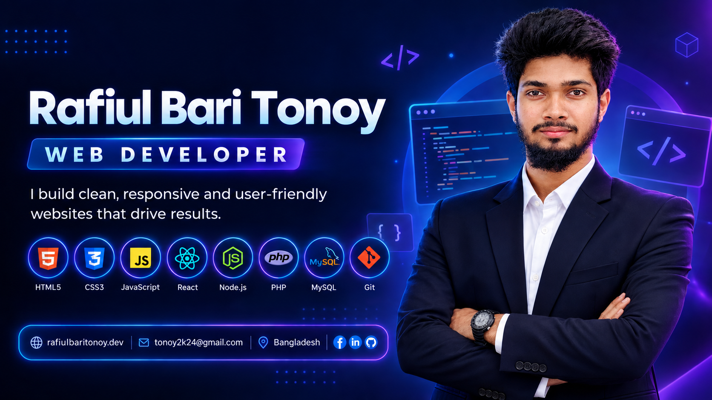

````md
<!-- ====================================================== -->
<!--                  ANIMATED HEADER                       -->
<!-- ====================================================== -->

<p align="center">
  
</p>

<br>

<div align="center">

# 👋 Hi, I'm Rafiul Bari Tonoy

### 💻 Full Stack Web Developer | JavaScript Enthusiast | Lifelong Learner

<br>


<br><br>


</div>

<br>

---

<!-- ====================================================== -->
<!--                    ABOUT ME                            -->
<!-- ====================================================== -->

## 🧑‍💻 About Me


Hi! I'm **Rafiul Bari Tonoy**, a passionate developer who enjoys building modern, responsive and user-friendly web applications.

- 🚀 Currently focused on **JavaScript, TypeScript, React.js & Next.js**
- 🧠 Improving my **problem-solving & programming skills**
- 🎨 Interested in **Frontend Development & UI/UX**
- 🔧 Exploring modern development tools and workflows
- 🌱 Continuously learning and building real-world projects
- 🤝 Open to collaboration and interesting projects
- 💡 My goal is to become a strong **Full Stack Web Developer**

<br clear="right"/>

---

<!-- ====================================================== -->
<!--                  CURRENT FOCUS                         -->
<!-- ====================================================== -->

## 🎯 Currently Learning

<div align="center">

| 🌱 Learning | 📚 Focus |
|---|---|
| 🟨 JavaScript | ES6+ • Problem Solving |
| 🔷 TypeScript | Types • Interfaces • Generics |
| ⚛️ React.js | Components • Hooks • State |
| ▲ Next.js | App Router • Server Components |
| 🔄 Redux | State Management |
| 🔗 REST API | API Integration |
| 🗄️ Database | MongoDB • PostgreSQL |
| 🚀 Deployment | Vercel • Netlify |

</div>

<br>

---

<!-- ====================================================== -->
<!--                 DEVELOPMENT ROADMAP                    -->
<!-- ====================================================== -->

## 🧭 My Development Roadmap

```text
                         WEB DEVELOPMENT
                                │
                ┌───────────────┴───────────────┐
                │                               │
             FRONTEND                         BACKEND
                │                               │
          HTML • CSS • JS                Server • API
                │                               │
           TypeScript                     Node.js
                │                               │
            React.js                     Express.js
                │                               │
            Next.js                     Database
                │                               │
                └───────────────┬───────────────┘
                                │
                          FULL STACK
                                │
                         Authentication
                                │
                         Deployment
                                │
                           DevOps 🚀
````

<br>

---

<!-- ====================================================== -->

<!--                 TECHNOLOGY STACK                       -->

<!-- ====================================================== -->

## 🛠️ Technology Stack

### 🌐 Frontend

<p align="center">
  
</p>

### ⚙️ Backend

<p align="center">
  
</p>

### 🗄️ Database & ORM

<p align="center">
  
</p>

### 🚀 Deployment

<p align="center">
  
</p>

### 🧰 Tools

<p align="center">
  
</p>

### 🎨 Design

<p align="center">
  
</p>

<br>

---

<!-- ====================================================== -->

<!--                  GITHUB STATISTICS                     -->

<!-- ====================================================== -->

## 📊 GitHub Statistics

<div align="center">


</div>

<br>

---

<!-- ====================================================== -->

<!--                    STREAK                              -->

<!-- ====================================================== -->

## 🔥 GitHub Streak

<p align="center">
  
</p>

<br>

---

<!-- ====================================================== -->

<!--                 CONTRIBUTION GRAPH                     -->

<!-- ====================================================== -->

## 📈 Contribution Activity

<p align="center">
  
</p>

<br>

---

<!-- ====================================================== -->

<!--                  SNAKE ANIMATION                       -->

<!-- ====================================================== -->

## 🐍 My Contribution Snake

<p align="center">
  
</p>

<br>

---

<!-- ====================================================== -->

<!--                   FEATURED PROJECTS                     -->

<!-- ====================================================== -->

## 🚀 Featured Projects

> I'm continuously building and improving projects as I learn new technologies.

<div align="center">

| 🚀 Project    | 📝 Description         | 🛠️ Technologies   |
| ------------- | ---------------------- | ------------------ |
| 🌐 Project 01 | Modern Web Application | React • TypeScript |
| ⚡ Project 02  | Full Stack Application | Next.js • API      |
| 💻 Project 03 | JavaScript Project     | JavaScript • React |

</div>

<br>

> ⭐ Check out my repositories to see what I'm currently building.

<br>

---

<!-- ====================================================== -->

<!--                WHAT I CAN WORK WITH                   -->

<!-- ====================================================== -->

## 💬 What I Can Work With

```text
Frontend
├── HTML
├── CSS
├── JavaScript
├── TypeScript
├── React.js
├── Next.js
└── Redux

Backend
├── Node.js
├── Express.js
└── REST API

Database
├── MongoDB
├── PostgreSQL
└── MySQL

Tools
├── Git
├── GitHub
├── VS Code
├── Postman
└── Docker
```

<br>

---

<!-- ====================================================== -->

<!--                    SOCIALS                             -->

<!-- ====================================================== -->

## 🌎 Connect With Me

<p align="center">

<a href="https://www.linkedin.com/in/rafiul-bari-tonoy-025768383/">
  
</a>

   

<a href="https://www.facebook.com/rafiulbaritonoy2k26">
  
</a>

   

<a href="mailto:tonoy2k24@gmail.com">
  
</a>

</p>

<br>

<div align="center">

### 📫 Let's Connect & Build Something Great Together! 🚀

</div>

<br>

---

<!-- ====================================================== -->

<!--                  DEVELOPER QUOTE                       -->

<!-- ====================================================== -->

## 💡 Developer Mindset

<p align="center">
  
</p>

<br>

---

<!-- ====================================================== -->

<!--                    FOOTER                              -->

<!-- ====================================================== -->

<p align="center">


</p>

<div align="center">

### ⭐ Thanks for visiting my profile!

**Keep Learning • Keep Building • Keep Growing 🚀**

</div>
```
